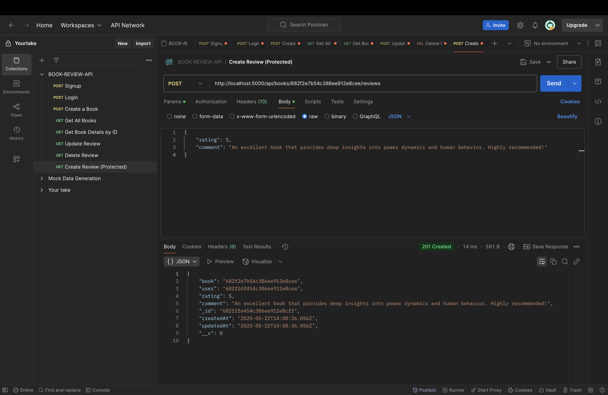

# Book Review API

A RESTful API for managing book reviews built with Node.js, Express, and MongoDB.

## Features

- User authentication with JWT
- Book management (create, read)
- Review management (create, update, delete)
- Search functionality
- Pagination
- Filtering by author and genre

## Prerequisites

- Node.js (v14 or higher)
- MongoDB
- npm or yarn

## Installation

1. Clone the repository:
```bash
git clone <repository-url>
cd book-review-api
```

2. Install dependencies:
```bash
npm install
```

3. Create a `.env` file in the root directory with the following variables:
```
PORT=5000
MONGODB_URI=mongodb://localhost:27017/book-review-api
JWT_SECRET=your_jwt_secret_key_here
```

4. Start the server:
```bash
npm start
```

## API Endpoints

### Authentication
- POST /api/signup - Register a new user
- POST /api/login - Login user

### Books
- POST /api/books - Create a new book (Protected)
- GET /api/books - Get all books (with pagination and filters)
- GET /api/books/:id - Get book details with reviews
- GET /api/search - Search books by title or author

### Reviews
- POST /api/books/:id/reviews - Create a review (Protected)
- PUT /api/reviews/:id - Update a review (Protected)
- DELETE /api/reviews/:id - Delete a review (Protected)

## API Testing with Postman

### 1. Authentication Endpoints

#### 1.1 Signup

- Endpoint: POST /api/signup
- Request Body:
```json
{
    "username": "swaraj",
    "email": "028swarajkumar@gmail.com",
    "password": "password123"
}
```

#### 1.2 Login

- Endpoint: POST /api/login
- Request Body:
```json
{
    "email": "028swarajkumar@gmail.com",
    "password": "password123"
}
```

### 2. Book Management Endpoints

#### 2.1 Create Book

- Endpoint: POST /api/books
- Headers: Authorization: Bearer {token}
- Request Body:
```json
{
    "title": "The 48 Laws of Power",
    "author": "Robert Greene",
    "genre": "Self-Help",
    "description": "The 48 Laws of Power is a self-help book by American author Robert Greene. The book is a bestseller, selling over 1.2 million copies in the United States, and is popular with prison inmates and celebrities."
}
```

#### 2.2 Get All Books

- Endpoint: GET /api/books
- Query Parameters: page, limit, author, genre

#### 2.3 Get Book by ID

- Endpoint: GET /api/books/:id
- Query Parameters: page, limit

### 3. Review Management Endpoints

#### 3.1 Create Review

- Endpoint: POST /api/books/:id/reviews
- Headers: Authorization: Bearer {token}
- Request Body:
```json
{
    "rating": 5,
    "comment": "An excellent book that provides deep insights into power dynamics and human behavior. Highly recommended!"
}
```

#### 3.2 Update Review

- Endpoint: PUT /api/reviews/:id
- Headers: Authorization: Bearer {token}
- Request Body:
```json
{
    "rating": 4,
    "comment": "Updated review: A great book with valuable insights, though some laws might be controversial."
}
```

#### 3.3 Delete Review

- Endpoint: DELETE /api/reviews/:id
- Headers: Authorization: Bearer {token}

## Error Handling

The API uses standard HTTP status codes:
- 200: Success
- 201: Created
- 400: Bad Request
- 401: Unauthorized
- 404: Not Found
- 500: Server Error

## Security

- Passwords are hashed using bcrypt
- JWT authentication for protected routes
- Input validation and sanitization
- CORS enabled 